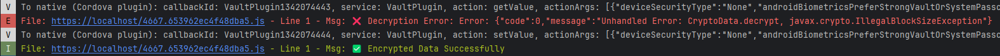

This is a reproduction sample of the issue with `Identity-Vault` where decrypting on **Android 16 real devices – especially on Pixel and Samsung devices** – sometimes throw `IllegalBlockSizeException`.

The issue occurs is hard to reproduce, because manually chunking the ciphertext can sometimes break the 16-byte alignment, which triggers the `IllegalBlockSizeException`.

# 📑 Table Of Content

- [🔧 Starting Project](#-starting-project)
- [📝 Project Description](#-project-description)
- [📱 Why the issue might not reproduce on the Android emulator](#-why-the-issue-might-not-reproduce-on-the-android-emulator)
- [🐞 Description of the Issue](#-description-of-the-issue)
- [💡 Proposed Solution](#-proposed-solution)

# 🔧 Starting Project

1. Create `.npmrc` file at the root of the project to include a registry for `@ionic-enterprise` packages and replace `ENTER_YOUR_TOKEN_HERE` with your Ionic access token

```
@ionic-enterprise:registry=https://registry.ionicframework.com/
//registry.ionicframework.com/:_authToken=ENTER_YOUR_TOKEN_HERE
```

2. Install dependencies

```bash
npm install
```

3. Build ionic

```bash
npx ionic build
```

4. Sync capacitor

```bash
npx cap sync
```

5. Open the project in Android Studio

```bash
npx cap open android
```

6. Select **a Pixel or Samsung device with Android 16** and click `Run`

7. Open Logcat and use `package:mine` filter to see only the application sample logs and encryption/decryption result added to the console

# 📝 Project Description

The reproduction sample uses fake data to be encrypted in the `Vault` and then decrypted.

## Reproduction steps

Follow theses steps to reproduce the issue where `IllegalBlockSizeException`
1. Click "Decrypt/Encrypt Data" button
2. The app will successfully decrypt value from the vault and encrypt the data
3. Kill the app and restart it on the phone **(not using run in Android Studio)**
4. Click "Decrypt/Encrypt Data" button
5. On the first decryption, you should see `IllegalBlockSizeException` error
6. Kill the app again and retry, it will still throw the error



All the code related to the issue is in `src\app\home\home.page.ts`.

## Try the fix

Now in Android Studio, find and open the `CryptoData.java` file located in `android/capacitor-cordova-android-plugins/src/main/java/com.ionicframework.IdentityVault` folder and replace the `encrypt` and `decrypt` methods with the one provided in the [proposed solution](#complete-fix-in-cryptodatajava).

1. Clean the Android project with `build > clean project`
2. Click "run" to start the application on the **Pixel or Samsung Android 16 device**
3. Reexecute the [reproduction steps](#reproduction-steps) provided above
4. You will notice that the `IllegalBlockSizeException` error is no longer thrown

# 📱 Why the issue might not reproduce on the Android emulator

It is absolutely possible that Identity-Vault’s AES/CBC bug appears only on real devices. In fact, **Pixel and Samsung phones are the two most common models where CBC decryption errors occur even when everything works fine on the emulator**.

Here’s why...

## 1. Pixel devices use strict BoringSSL crypto

Google Pixel devices ship with a hardened version of BoringSSL, and their AES/CBC implementation is much more strict about:

- block alignment
- leftover bytes
- incorrect padding
- truncated ciphertext

If decryption receives even one incomplete CBC block because of chunking, Pixel phones will immediately throw:

```
javax.crypto.IllegalBlockSizeException
javax.crypto.BadPaddingException
error:1e000065:Cipher routines::BAD_DECRYPT
```

The emulator, however, often uses a more permissive desktop OpenSSL implementation or a non-hardware provider.

## 2. Samsung devices use hardware-backed AES engines

Samsung ships custom hardware crypto stacks (TrustZone-backed), which behave differently from standard Android JCA providers.

Samsung AES/CBC engines:
- require full 16-byte blocks
- reject any malformed ciphertext strictly
- perform padding verification in hardware
- flush buffers differently than the emulator

If the app decrypts CBC data in small chunks (like in the Identity-Vault implementation), Samsung devices are much more likely to fail.

This is exactly why many CBC bugs appear only on Samsung Galaxy devices.

## 3. Emulators do not use hardware crypto at all

Android emulators:
- run x86 software crypto
- often rely on the host machine’s OpenSSL
- do not use TEE / Secure Hardware
- behave differently with CipherInputStream and padding

This means an emulator may accidentally “fix” your chunks by reading data in larger, more convenient buffer sizes, so the error never appears.

On a real Pixel or Samsung, CryptoData.decrypt receives the malformed chunk exactly as produced — and fails.

## 4. Pixels and Samsungs handle input buffering differently

- Pixel: BoringSSL CBC eagerly validates blocks
- Samsung: TrustZone CBC validates padding after each block
- Emulator: JCA implementation buffers more data before decrypting

So **the same bug does not trigger on the emulator** because the buffering behavior is different.

# 🐞 Description of the Issue

On Android, Identity-Vault fails to decrypt stored values when using the default AES-CBC-PKCS5 encryption. The failure is triggered with the exception:

```
javax.crypto.IllegalBlockSizeException: last block incomplete in decryption
```

This bug occurs because the plugin processes ciphertext in arbitrary chunks using `cipher.update()` inside a loop. CBC mode cannot be safely decrypted with manually chunked ciphertext unless the chunk boundaries align perfectly with AES block boundaries (16 bytes). If they do not, Android’s crypto implementation throws the exception above.

## Where the Problem Occurs (Identity-Vault Android Code)

Identity-Vault performs encryption/decryption using logic similar to:

```java
while (inputOffset < data.length) {
    int inputLength = Math.min(CHUNK_SIZE, data.length - inputOffset);
    byte[] output = cipher.update(data, inputOffset, inputLength);
    if (output != null) outputStream.write(output);
    inputOffset += inputLength;
}
byte[] finalBytes = cipher.doFinal();
```

## Why this is wrong

AES/CBC/PKCS5Padding **requires the full ciphertext stream** so padding and block chaining can be validated properly. Feeding fragmented ciphertext into `cipher.update()` breaks block alignment, causing padding to become invalid → resulting in `IllegalBlockSizeException` during decryption.

# 💡 Proposed Solution

Replace the manual chunked loop with a `CipherInputStream`, which fully supports CBC, PKCS padding, and arbitrary ciphertext lengths without alignment issues.

## Correct CBC-Safe Implementation

```java
Cipher cipher = Cipher.getInstance("AES/CBC/PKCS5Padding");
cipher.init(Cipher.DECRYPT_MODE, secretKey, new IvParameterSpec(iv));

ByteArrayInputStream bais = new ByteArrayInputStream(ciphertext);
CipherInputStream cis = new CipherInputStream(bais, cipher);
ByteArrayOutputStream baos = new ByteArrayOutputStream();

byte[] buffer = new byte[2048];
int n;
while ((n = cis.read(buffer)) != -1) {
    baos.write(buffer, 0, n);
}

byte[] decrypted = baos.toByteArray();
```

## Why this works
- Ensures AES block alignment automatically
- Correctly handles PKCS padding
- Works with any ciphertext size, chunked or continuous
- Prevents `IllegalBlockSizeException`
- Compatible across all Android versions Identity-Vault supports

# Expected Outcome

After replacing the chunked `cipher.update()` logic with `CipherInputStream`, stored credentials decrypt correctly on Android with no errors, and behavior matches iOS and Web implementations.

## Complete fix in `CryptoData.java`

Below is a corrected implementation of `encrypt` and `decrypt` that we tested and fixed the issue using `CipherInputStream` and `CipherOutputStream`, which are safe for CBC and PKCS padding.

## Corrected `encrypt` method

```java
public static String encrypt(String alias, String dataJsonString, String customPasscode, Context context)
    throws VaultError {
    try {
        if (customPasscode != null) {
            dataJsonString = PasswordBasedCrypto.encrypt(customPasscode, dataJsonString);
        }
        SecretKey secretKey = getOrCreateKey(alias, context);
        Cipher cipher = Cipher.getInstance(EncryptionConstants.AES_CBC_PADDED_TRANSFORM_ANDROID_M);
        cipher.init(Cipher.ENCRYPT_MODE, secretKey);
        byte[] iv = cipher.getIV();
        byte[] dataBytes = dataJsonString.getBytes(StandardCharsets.UTF_8);

        ByteArrayOutputStream outputStream = new ByteArrayOutputStream();
        CipherOutputStream cipherOutputStream = new CipherOutputStream(outputStream, cipher);

        cipherOutputStream.write(dataBytes);
        cipherOutputStream.close(); // triggers doFinal()

        byte[] encryptedBytes = outputStream.toByteArray();
        outputStream.close();

        CryptoData cryptoData = CryptoData.create(encryptedBytes, iv, new byte[0]);
        return cryptoData.toJSON();
    } catch (InvalidKeyException e) {
        e.printStackTrace();
        throw new UnexpectedKeystoreError(e.getLocalizedMessage());
    } catch (Exception e) {
        throw new VaultError("CryptoData.encrypt, " + e);
    }
}
```

## Corrected `decrypt` method

```java
public static String decrypt(String alias, String encryptedDataJson, String customPasscode, Context context)
    throws VaultError, JSONException {
    try {
        CryptoData cryptoData = CryptoData.create(encryptedDataJson);
        SecretKey secretKey = getOrCreateKey(alias, context);
        Cipher cipher = Cipher.getInstance(EncryptionConstants.AES_CBC_PADDED_TRANSFORM_ANDROID_M);
        cipher.init(Cipher.DECRYPT_MODE, secretKey, new IvParameterSpec(cryptoData.iv));

        ByteArrayInputStream inputStream = new ByteArrayInputStream(cryptoData.data);
        CipherInputStream cipherInputStream = new CipherInputStream(inputStream, cipher);
        ByteArrayOutputStream outputStream = new ByteArrayOutputStream();

        byte[] buffer = new byte[4096];
        int read;
        while ((read = cipherInputStream.read(buffer)) != -1) {
            outputStream.write(buffer, 0, read);
        }

        byte[] decryptedDataBytes = outputStream.toByteArray();
        outputStream.close();
        inputStream.close();
        cipherInputStream.close();

        String decryptedDataJson = new String(decryptedDataBytes, StandardCharsets.UTF_8);
        if (customPasscode != null) {
            CryptoData encryptedPasscodeData = CryptoData.create(decryptedDataJson);
            decryptedDataJson = PasswordBasedCrypto.decrypt(customPasscode, encryptedPasscodeData);
        }
        return decryptedDataJson;
    } catch (InvalidKeyException e) {
        e.printStackTrace();
        throw new UnexpectedKeystoreError(e.getLocalizedMessage());
    } catch (JSONException e) {
        e.printStackTrace();
        throw e;
    } catch (Exception e) {
        throw new VaultError("CryptoData.decrypt, " + e);
    }
}
```
